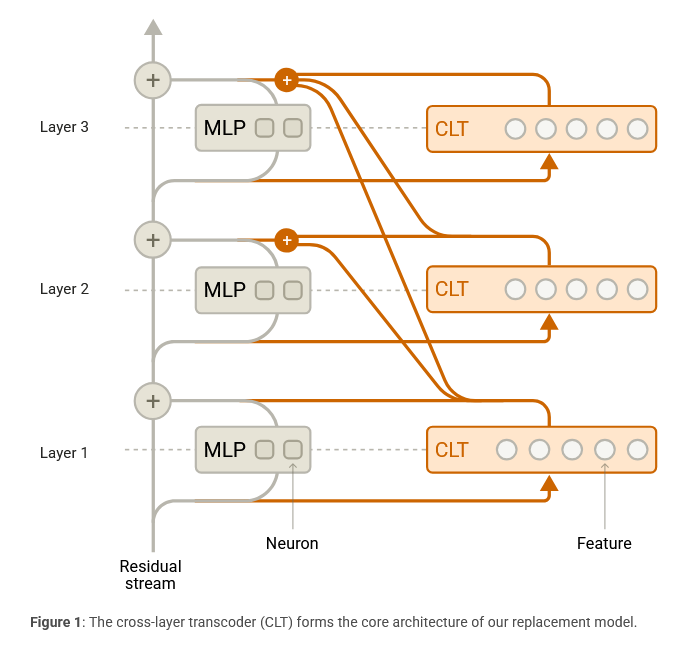

# Cross-Layer Transcoder (CLT) Overview

## Architecture
A CLT consists of neurons ("features") divided into \(L\) layers, matching the underlying model's layer count. Key characteristics:

- **Input**: Features read from the residual stream at their associated layer.
- **Cross-Layer Output**: Features can provide output to all subsequent layers.
- **Feature Activation**:  
  \(\mathbf{a}^{\ell} = \text{JumpReLU}\big(W_{enc}^{\ell}\mathbf{x}^{\ell}\big)\)  
  where:
  - \(\mathbf{x}^{\ell}\): Residual stream activations at layer \(\ell\).
  - \(W_{enc}^{\ell}\): Encoder matrix at layer \(\ell\).

## Reconstruction
The CLT reconstructs the original model's MLP outputs \(\mathbf{y}^{\ell}\) using:  
\(\hat{\mathbf{y}}^{\ell} = \sum_{\ell'=1}^{\ell} W_{dec}^{\ell'-\nu\ell}\mathbf{a}^{\ell'}\)  
where \(W_{dec}^{\ell'-\nu\ell}\) is the decoder matrix for features at layer \(\ell'\) outputting to layer \(\ell\).

## Training
The training minimizes a combined loss function:

1. **Reconstruction Loss**:  
   \(L_{\text{MSE}} = \sum_{\ell=1}^{L} ||\hat{\mathbf{y}}^{\ell} - \mathbf{y}^{\ell}||^2\)

2. **Sparsity Penalty**:  
   \(L_{\text{sparsity}} = \lambda \sum_{\ell=1}^{L} \sum_{i=1}^{N} \tanh(c \cdot ||\mathbf{W}_{dec,i}^{\ell}|| \cdot \alpha_i^{\ell})\)  
   where:
   - \(\lambda, c\): Hyperparameters.
   - \(N\): Number of features per layer.
   - \(\mathbf{W}_{dec,i}^{\ell}\): Concatenated decoder vectors of feature \(i\).

## Experimental Setup
- **Models**: Trained on an 18-layer transformer ("18L") and Claude 3.5 Haiku.
- **Feature Counts**:
  - 18L: 300K to 10M features.
  - Haiku: 300K to 30M features.

For implementation details, refer to [Appendix D](#) in the original document.