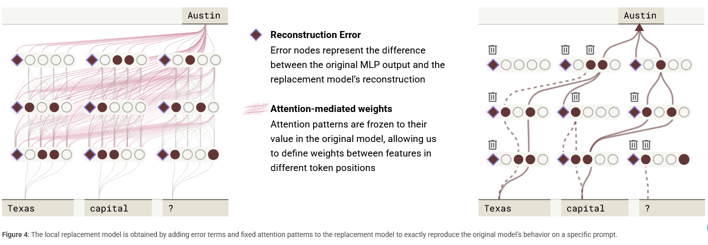

# § 2.2 From Cross-Layer Transcoder to Replacement Model

Given a trained cross-layer transcoder, we can define a "replacement model" that substitutes the cross-layer transcoder features for the model's MLP neurons – that is, where each layer's MLP output is replaced by its reconstruction by all CLTs that write to the that layer. Running a forward pass of this replacement model is identical to running the original model, with two modifications:

- Upon reaching the input to the MLP in layer \(\ell\), we compute the activations of the cross-layer transcoder features whose encoders live in layer \(\ell\).

- Upon reaching the output of the MLP in layer \(\ell\), we overwrite it with the summed outputs of the cross-layer transcoder features in this and previous layers, using their decoders for layer \(\ell\).

Attention layers are applied as usual, without any freezing or modification. Although our CLTs were only trained using input activations from the underlying model, "running" the replacement model involves running CLTs on "off-distribution" input activations from intermediate activations from the replacement model itself.

# Evaluation Results

As a simple evaluation, we measure the fraction of completions for which the most likely token output of the replacement model matches that of the underlying model. The fraction improves with scale, and is better for CLTs compared to a per-layer transcoder baseline (i.e., each layer has a standard single layer transcoder trained on it; the number of features shown refers to the total number across all layers). We also compare to a baseline of thresholded neurons, varying the threshold below which neurons are zeroed out (empirically, we find that higher neuron activations are increasingly interpretable, and we indicate below where their interpretability roughly matches that of features according to our auto-evaluations in § 5.1.2 Quantitative CLT Evaluations). Our largest 18L CLT matches the underlying model's next-token completion on 50% of a diverse set of pretraining-style prompts from an open source dataset (see § R Additional Evaluation Details).\(^6\)

# § 2.3 The Local Replacement Model

While running the replacement model can sometimes reproduce the same outputs as the underlying model, there is still a significant gap, and reconstruction errors can compound across layers. Since we are ultimately interested in understanding the underlying model, we would like to approximate it as closely as possible. To that end, when studying a fixed prompt \( p \), we construct a local replacement model, which

- Substitutes the CLT for the MLP layers (as in the replacement model);
- Uses the attention patterns and normalization denominators from the underlying model's forward pass on \( p \) (as in [18, 12]);
- Adds an error adjustment to the CLT output at each (token position, layer) pair equal to the difference between the true MLP output on \( p \) and the CLT output on \( p \) (as in [16]).

After this error adjustment and freezing of attention and normalization nonlinearities, we've effectively re-written the underlying model's computation on the prompt \( p \) in terms of different basic units; all of the error-corrected replacement model's activations and logit outputs exactly match those of the underlying model. However, this does not guarantee that the local replacement model and underlying model use the same mechanisms. We can measure differences in mechanism by measuring how differently these models respond to perturbations; we refer to the extent to which perturbation behavior matches as "mechanistic faithfulness", discussed in § 5.3 Evaluation Mechanistic Faithfulness.\(^7\)

The local replacement model can be viewed as a very large fully connected neural network, spanning across tokens, on which we can do classic circuit analysis:

- Its input is the concatenated set of one-hot vectors for each token in the prompt.
- Its neurons are the union of the CLT features active at every token position.
- Its weights are the summed interactions over all the linear paths from one feature to another, including via the residual stream and through attention, but not passing through MLP or CLT layers. Because attention patterns and normalization denominators are frozen, the impact of a source feature's activation on a target feature's pre-activation via each path is linear in the activation of the source feature. We sometimes refer to these as "virtual weights" because they are not instantiated in the underlying model.

- Additionally, it has bias-like nodes corresponding to error terms, with a connection from each bias to each downstream neuron in the model.

The only nonlinearities in the local replacement model are those applied to feature preactivations.

The local replacement model serves as the basis of our attribution graphs, where we study the feature-feature interactions of the local replacement model on the prompt for which it was made. These graphs are the primary object of study of this paper.
